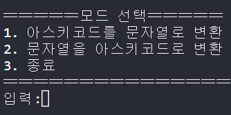
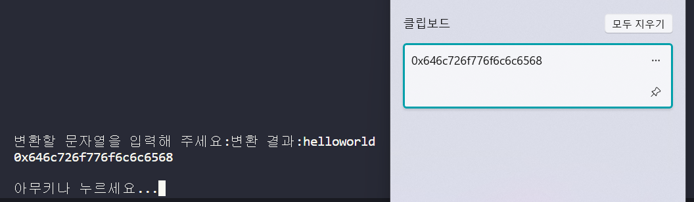
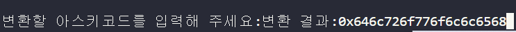
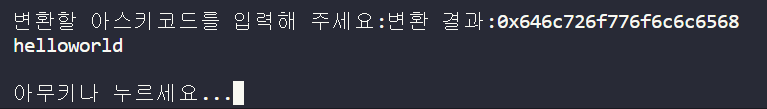

# AsciiTools 
<h1>=====실행=====</h1>
실행을 하면 안내 문자가 뜬다.

2번을 선택하여 문자열을 입력한다

문자열을 16진수 아스키 코드로 바꾼 결과가 나온다.
<br> 그 결과는 클립보드에 바로 저장된다.

아무키나 눌러서 나오면 다시 안내문자가 나온다.
<br>이번에는 1번을 선택하고

아까 클립보드에 저장된 16진수 아스키코드를 붙여넣기 한다

이번 결과도 클립보드에 저장된다.


```python
import clipboard

#아스키코드로 변환
def str_ascii():
    input_str=list(map(hex,map(ord,input())))
    input_str.reverse()
    temp='0x'
    for i in input_str:
        temp+=i[2:]
    clipboard.copy(temp)
    print(temp)
#아스키코드를 변환
def ascii_str():
    input_ascii=input()[2:]
    reverse_ascii=[]
    for i in range(0,len(input_ascii),2):
        reverse_ascii.append(chr(int("0x"+input_ascii[i]+input_ascii[i+1],16)))
    reverse_ascii.reverse()
    temp=''.join(reverse_ascii)
    clipboard.copy(temp)
    print(temp)
    # for i in reverse_ascii:
    #     print(i,end='')
while(True):
    print("\n"*50)
    print("〓〓〓〓〓모드 선택〓〓〓〓〓")
    print("1. 아스키코드를 문자열로 변환")
    print("2. 문자열을 아스키코드로 변환")
    print("3. 종료")
    print("〓〓〓〓〓〓〓〓〓〓〓〓〓〓〓")
    mode=input("입력:")
    print("\n"*50)
    if(mode=='1'):
        print("변환할 아스키코드를 입력해 주세요:",end='')
        print("변환 결과:",end='')
        ascii_str()
        print()
        input("아무키나 누르세요...")
    elif(mode=='2'):
        print("변환할 문자열을 입력해 주세요:",end='')
        print("변환 결과:",end='')
        str_ascii()
        print()
        input("아무키나 누르세요...")
    else:
        break
```
